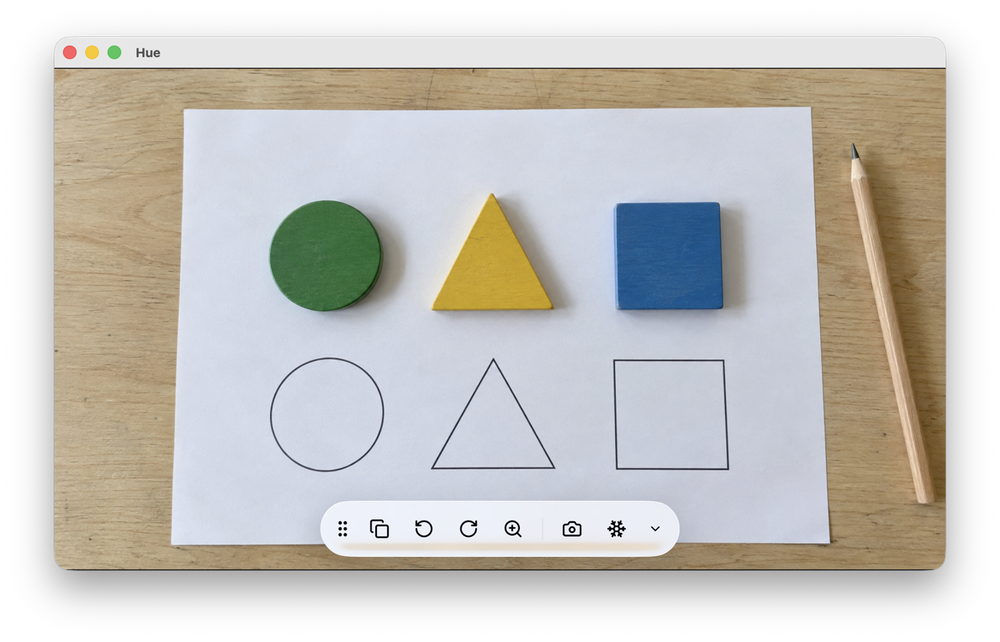

# Hue Camera Viewer

**[Download for macOS](https://github.com/piitaya/hue-camera-viewer/releases/latest/download/Hue-Camera-Viewer-macOS.dmg)** · **[Download for Windows](https://github.com/piitaya/hue-camera-viewer/releases/latest/download/Hue-Camera-Viewer-Windows.exe)** · [All releases](https://github.com/piitaya/hue-camera-viewer/releases)

**English** | [Français](README.fr.md)

A minimal viewer for HUE and USB document cameras. Plug in the camera, show the page on the
screen or the projector, and save a picture when you need one. Native apps for macOS and
Windows, in English and French.

> Independent project, not affiliated with HUE. This app is compatible with HUE cameras.

## Features

- Live preview of the camera, full screen in the window, with the HUE camera picked automatically.
- Rotation by quarter turns, remembered between launches.
- Zoom from 100 to 400 % with a slider, the scroll wheel or a trackpad pinch.
- Freeze the image while you turn a page; the camera keeps running so resuming is instant.
- One-click PNG captures at full resolution, saved to the Desktop.
- A toolbar you can move to any edge of the window or hide, with keyboard shortcuts for everything.

## Install

**macOS 13 or later**, Intel and Apple Silicon: open the DMG and drag Hue to Applications.

**Windows 10 (2004) or later**, x64 and ARM64: run the installer, then open Hue from the
Start menu. The installer is not signed: if SmartScreen shows a warning, choose "More info",
then "Run anyway".

On first launch, allow camera access when the system asks. The app picks the HUE camera by
itself when one is connected; use the camera button to choose another one.

## Use

The toolbar sits on one edge of the window. Drag its handle to move it to another edge, and
use the chevron to hide or show it.

| Button | What it does |
| --- | --- |
| Camera | Choose the camera; also opens the keyboard shortcuts list |
| Rotate left / right | Turn the image by a quarter turn; the choice is remembered |
| Magnifier | Zoom the preview from 100 to 400 %; the scroll wheel and a trackpad pinch zoom too, and a zoomed image can be dragged around |
| Capture | Save a full-resolution PNG to the Desktop |
| Snowflake | Freeze the image while you turn a page or move the camera; rotation, zoom and capture keep working on the frozen image |

| Action | macOS | Windows |
| --- | --- | --- |
| Capture to Desktop | ⌘S | Ctrl+S |
| Rotate left / right | ⌘← / ⌘→ | Ctrl+← / Ctrl+→ |
| Zoom in / out / 100 % | ⌘+ / ⌘− / ⌘0 | Ctrl++ / Ctrl+− / Ctrl+0 |
| Freeze or resume the image | ⌘F | Ctrl+F |
| Hide or show the toolbar | ⌥⌘T | Ctrl+T |

## Cameras

Hue Camera Viewer uses cameras exposed by the operating system.

| Camera family | Connection |
| --- | --- |
| [HUE HD Pro](https://huehd.com/pro/) (1080p) | USB UVC |
| [HUE HD](https://huehd.com/products/hue-hd-camera/) (720p and 1080p UVC models) | USB UVC |
| Other USB webcams and document cameras | Standard UVC video |
| Built-in Mac and PC cameras | System camera support |

This covers camera families, not an exhaustive list of tested models. Individual device
compatibility can vary; older cameras requiring proprietary drivers are not covered.
Hue Camera Viewer is an independent project, not affiliated with HUE or the other camera manufacturers listed here.

## Development

- `apps/macos`: Swift app and DMG packaging, see the [macOS guide](apps/macos/README.md).
- `apps/windows`: C# app, tests, and Windows packaging, see the [Windows guide](apps/windows/README.md).
- `assets`: shared app icons.
- `scripts`: version bump and CI helpers.

Pull requests and pushes to `main` build and test the affected apps, skipping documentation-only
changes. Manual runs build both apps. Preview builds of every change stay available for three
days in the [GitHub Actions](https://github.com/piitaya/hue-camera-viewer/actions/workflows/build.yml) artifacts; those macOS previews are not notarized.

To release, bump the version with `bash scripts/set-version.sh 1.2.0`, commit, then publish a
GitHub release whose tag looks like `v1.2.0` (or `v1.2.0-beta.1`). The
[release workflow](.github/workflows/release.yml) checks that both apps declare the tag's
version, builds them, and attaches `Hue-Camera-Viewer-macOS.dmg` (signed and notarized) and
`Hue-Camera-Viewer-Windows.exe` (unsigned) to the release. The file names carry no version so
the download links above always point at the latest release; the version is in the release
title and in the app. The macOS signing secrets are described in the
[macOS guide](apps/macos/README.md#release-signing).

Licensed under the [MIT License](LICENSE).
