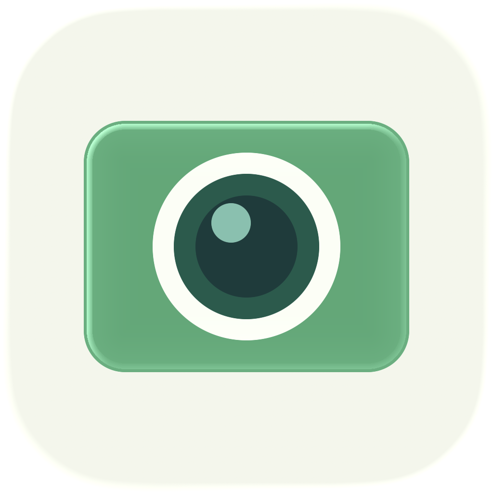

# Hue Camera Viewer

> Independent project, not affiliated with HUE. This app is compatible with HUE cameras.

**English** | [Français](README.fr.md)

A minimal viewer for HUE and USB document cameras: live preview, rotation, zoom and
freeze, and PNG captures saved to your Desktop, with a movable, collapsible toolbar.

**English and French · Native apps for macOS and Windows**

| App | Requirements | Development |
| --- | --- | --- |
| macOS | macOS 13+, Intel or Apple Silicon | [macOS guide](apps/macos/README.md) |
| Windows | Windows 10 (2004)+ x64; Windows 11 x64 or ARM64 | [Windows guide](apps/windows/README.md) |

## Install

**[Download for macOS](https://github.com/piitaya/hue-camera-viewer/releases/latest)** · **[Download for Windows](https://github.com/piitaya/hue-camera-viewer/releases/latest)**

On macOS, open the DMG and drag Hue to Applications.
On Windows, run `Hue-Setup.exe`, then open Hue from the Start menu.
Connect your camera and allow camera access when prompted.

The macOS app is not notarized, and the unsigned Windows installer may trigger a
Microsoft SmartScreen warning. Preview builds of every change are also available for
three days in the [GitHub Actions](https://github.com/piitaya/hue-camera-viewer/actions/workflows/build.yml) artifacts.

## Cameras

Hue Camera Viewer uses cameras exposed by the operating system.

| Camera family | Connection |
| --- | --- |
| [HUE HD Pro](https://huehd.com/pro/) (1080p) | USB UVC |
| [HUE HD](https://huehd.com/products/hue-hd-camera/) (720p and 1080p UVC models) | USB UVC |
| Other USB webcams and document cameras | Standard UVC video |
| Built-in Mac and PC cameras | System camera support |

This covers camera families, not an exhaustive list of tested models. Individual device
compatibility can vary; older cameras requiring proprietary drivers are not covered.
Hue Camera Viewer is an independent project, not affiliated with HUE or the other camera manufacturers listed here.

## Repository

- `apps/macos`: Swift app and DMG packaging.
- `apps/windows`: C# app, tests, and Windows packaging.
- `assets`: shared app icons.

Pull requests and pushes to `main` build and test the affected apps, skipping documentation-only
changes. Manual runs build both apps.

Licensed under the [MIT License](LICENSE).
